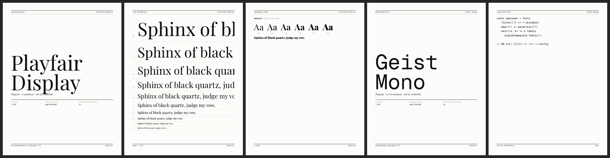

# waterfall

**A specimen machine. Point it at a font file, walk away with the booklet.**

[](LICENSE)
[](waterfall.mjs)



## The Specimen

Every font on your machine deserves better than a name in a dropdown.
waterfall reads a font file and sets a print-ready specimen **in the font
itself**: a cover, the size waterfall, the character set, and a text setting,
as a Letter PDF.

```bash
git clone https://github.com/vcspr/waterfall && cd waterfall
npm install && npx playwright install chromium

node waterfall.mjs examples/PlayfairDisplay-Variable.ttf
open out/playfair-display.pdf
```

TTF, OTF, TTC, WOFF, WOFF2.

## Provenance

Nothing on the specimen is typed in by hand. The family name, style, glyph
count, variable axes, and OpenType feature tags are read straight from the
font's own tables (via fontkit). The specimen is the font's ID card, issued
by the font.

## The Cascade

The layout adapts to what the font actually is:

- **Variable fonts** get an axis page: a ramp across each axis, min to max,
  with the full range printed under every step.
- **Monospaced fonts** get a code setting instead of a prose page, with the
  characters that matter at 2am: `0O 1lI| {}[]()`.
- Serif/sans classification comes from the font's PANOSE record when it
  bothered to fill one in.

## Setting

Five pages, Letter portrait: cover · waterfall (96pt to 9pt) · character set
with feature tags · variable axes (when present) · text or code setting. The
whole page system is one HTML template inside `waterfall.mjs`; the PDF is
printed by headless Chromium, so what the CSS says is what the paper gets.

## Colophon

The example fonts are [Geist Mono](examples/OFL-GeistMono.txt) and
[Playfair Display](examples/OFL-PlayfairDisplay.txt), each under the SIL Open
Font License. waterfall itself is [MIT](LICENSE) © 2026 Victor Uwakwe.

On the bench: WOFF2 web preview mode, multi-font family books, a
`--compare` spread that sets two fonts against each other.
